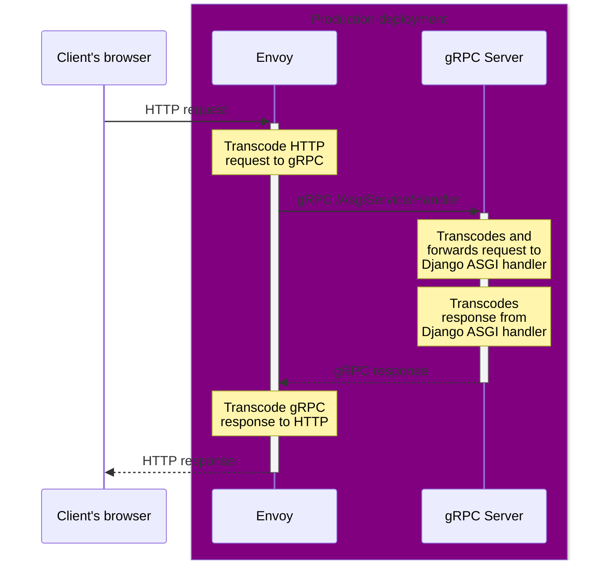
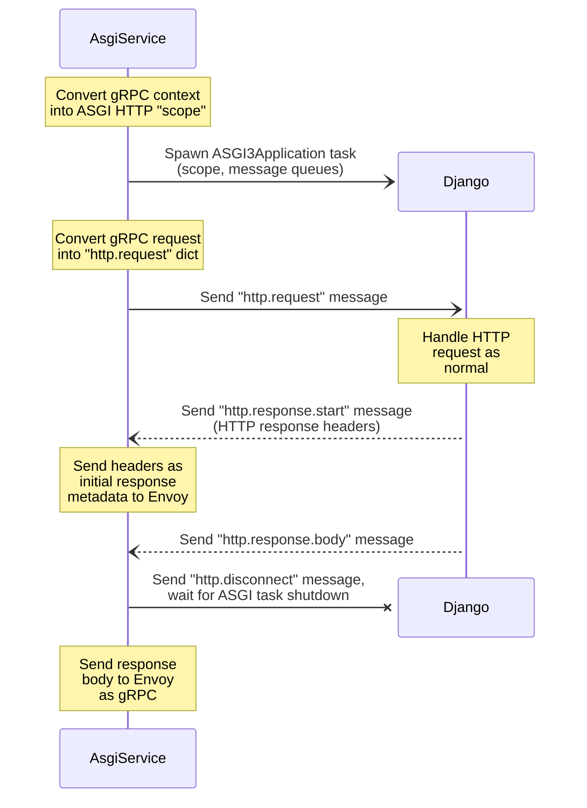
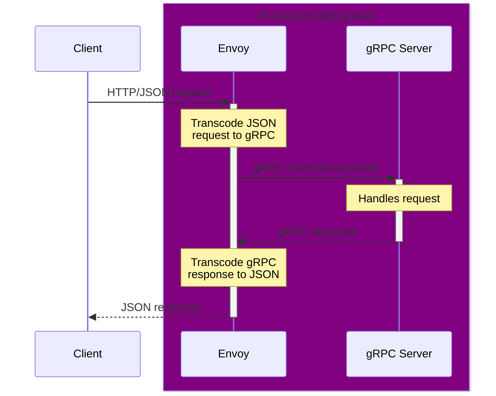
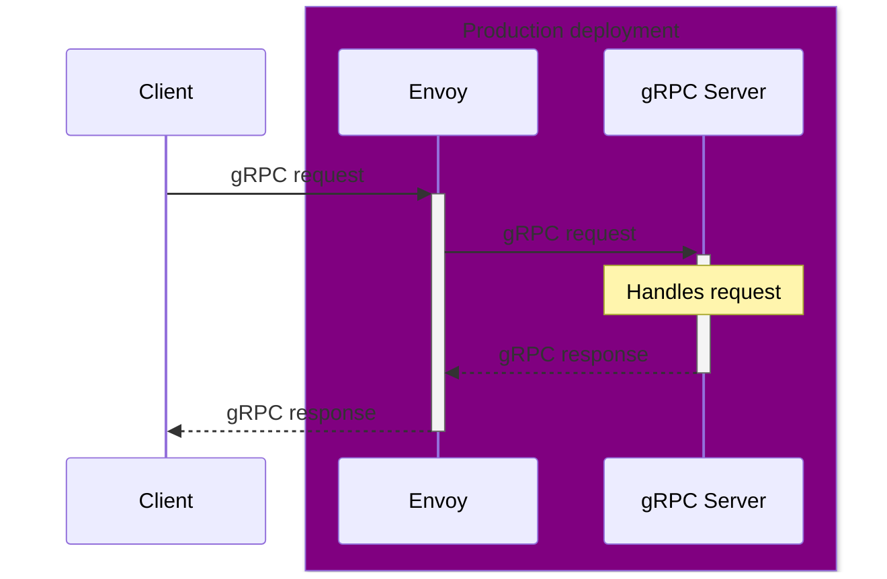

# Architecture

_In this document:_

- [Useful concepts](#useful-concepts) and background about the components used
- [Request flows](#request-flows) in the demo

## Useful concepts

_In this section:_ [ASGI concepts](#asgi-concepts) |
[gRPC concepts](#grpc-concepts) |
[gRPC-JSON transcoding concepts](#grpc-json-transcoding-concepts)

### ASGI concepts

- [In ASGI][asgi-proto], the protocol server (eg: [uvicorn][]) instanciates an
  _application_ (ie: Django) for each incoming HTTP request.

  These run in the same Python process, and they communicate using message
  queues.

  The _application_ instance is shut down at the end of the request.

- Application frameworks (like Django) normally have a bootstrap process that
  allows them to perform expensive start-up tasks once, and re-use resources
  (like database connections) between requests.

### gRPC concepts

- gRPC as a protocol normally [runs over HTTP/2][grpc-http2] _only_.

- Like regular HTTP requests, gRPC has request headers (in the context) and
  response headers (in the response metadata).

- gRPC servers listen on a TCP (or UNIX) socket directly. The Python gRPC SDK
  doesn't support running inside an ASGI or WSGI protocol server, as those are
  generally incompatible with [the gRPC-over-HTTP/2 protocol][grpc-http2].

- gRPC service APIs are defined in [`.proto` file(s)][service.proto].

  `protoc` uses the `.proto` file(s) to generate Python bindings
  (`*_pb2{,_grpc}.py{,i}` files), which you can `import` as a Python module in
  your client and server.

  You could also use this to build bindings for other languages.

- Web browsers and client-side scripts can't make regular gRPC requests. You
  need a transcoding proxy like [gRPC-JSON][grpc-json] or [gRPC-Web][grpc-web].

- A Python gRPC AIO (`asyncio`) service implementation is a class (instanciated
  at server start-up time) with an `async` method for each method.

  There's also a "classic" Python gRPC server framework, which uses regular
  synchronous methods.

### gRPC-JSON transcoding concepts

- gRPC request and response payloads are binary Protobuf with field IDs only
  (not names). JSON request and response payloads use field names.

- [Protobuf has a defined JSON conversion process][proto-json], which is used by
  gRPC-JSON transcoders.

- A gRPC-JSON transcoder (like Envoy) needs a Protobuf `FileDescriptorSet` of
  the gRPC service and all its dependencies to:

  - Convert message field IDs to/from field names
  - Convert [Protobuf wire types][proto-wire] into JSON types
  - Configure HTTP request routing (using `google.api.http` annotations)

  This is built from [a custom Hatch plugin][hatch-build], and then extracted
  as part of the Docker build process.

## Request flows

_In this section:_ [ASGI](#asgi-request-flow) |
[JSON API](#json-api-request-flow) | [gRPC API](#grpc-api-request-flow)

### ASGI request flow

Regular (non-JSON API) HTTP requests are transcoded by Envoy to gRPC, and sent
to our gRPC server as a `AsgiService.Handler` call:

As far as a client's browser is concerned, it's making normal HTTP requests, and
getting normal HTTP responses. It doesn't even have to use HTTP/2!

Inside of [our gRPC server][server], [`AsgiService`][AsgiService] transcodes
requests and responses to/from [ASGI-compatible API calls][asgi-http] for
Django's ASGI handler:

As far as Django is concerned, it's talking to a perfectly normal ASGI protocol
server that always gets HTTP/2 requests.

### JSON API request flow

This is all pretty ordinary for [gRPC-JSON transcoding][grpc-json], and there's
nothing particularly special here.

Envoy routes and transcodes requests to gRPC based on `google.api.http`
annotations in [`service.proto`][service.proto]:

### gRPC API request flow

[Envoy is configured](./envoy/envoy.yaml) to pass-through select gRPC method
paths:

[AsgiService]: ./server/src/grpc_asgi_django_demo/server/asgi_impl.py
[asgi-http]: https://asgi.readthedocs.io/en/latest/specs/www.html
[asgi-proto]: https://asgi.readthedocs.io/en/latest/specs/main.html#overview
[grpc-json]: https://www.envoyproxy.io/docs/envoy/latest/configuration/http/http_filters/grpc_json_transcoder_filter
[grpc-http2]: https://github.com/grpc/grpc/blob/master/doc/PROTOCOL-HTTP2.md
[grpc-web]: https://www.envoyproxy.io/docs/envoy/latest/configuration/http/http_filters/grpc_web_filter
[hatch-build]: ./proto/hatch_build.py
[proto-json]: https://protobuf.dev/programming-guides/json/
[proto-wire]: https://protobuf.dev/programming-guides/encoding/#structure
[server]: ./server/
[service.proto]: ./proto/proto/grpc_asgi_django_demo/proto/v1/service.proto
[uvicorn]: https://www.uvicorn.org/
