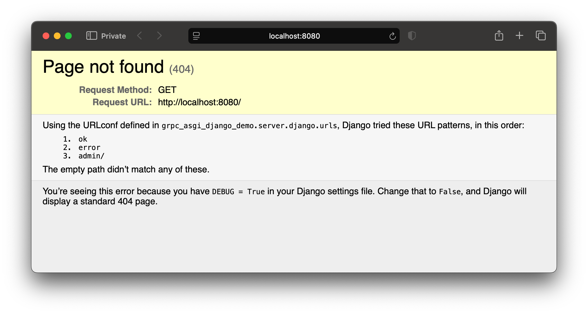
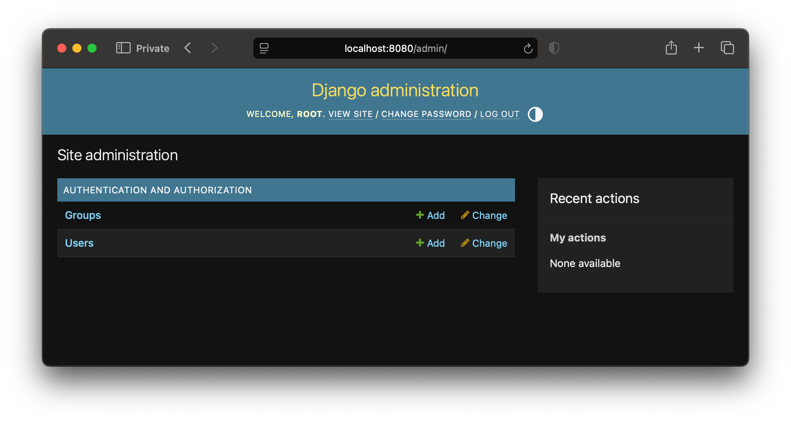

# Demo environment

_In this document:_

- [Overview](#overview) of what's in the demo
- [Getting started](#getting-started) building and running the demo
- [Tour](#tour) of key functionality
- [Limitations](#limitations) of the demo environment

## Overview

The demo environment is built with Docker Compose.

It consists of:

- Envoy running as a HTTP load balancer and gRPC-JSON transcoder.
- The [gRPC ASGI demo server](./server/), running a basic Django application and
  providing a [demo gRPC API][service.proto] (`DemoService.Add`).
- [`grpc-health-probe`][grpc-health-probe] is used as a Docker health check for
  the gRPC server.

## Getting started

The demo container environment requires:

- [Docker Engine and Docker Compose][docker-engine] (v28.1.0 or later, released
  2025-04-17)
- `openssl` (to generate secrets in a `.env` file)

> [!IMPORTANT]
>
> [Install Docker Engine from upstream packages][docker-engine]!
>
> Many Linux distributions ship _very old_ versions of Docker (eg: Debian),
> which contain _many_ bugs, and do not support the functionality needed to
> build and run this project.

To get everything running:

```sh
# Generate a .env file with a random SECRET_KEY for Django
./scripts/generate_env.sh

# Turn up the environment
docker compose up --build --watch --abort-on-container-failure
```

Once the environment is built and running, point your browser at
http://localhost:8080/, and you should be greeted with a Django debug mode 404
error page:



This runs [Django's ASGI handler via HTTP-over-gRPC](./architecture.md#asgi-request-flow).

## Tour

### Create a Django superuser and access Django admin

To create an initial Django superuser account, you can use the `gadd-manage`
command inside of the container to run `manage.py` commands:

```sh
docker compose exec grpc-asgi-server gadd-manage createsuperuser
```

Once you have a superuser account, you should be able to use it to log in to
the Django admin interface at http://localhost:8080/admin/.



This demonstrates that basic HTTP `GET` and `POST` requests work with arbitrary
content.

### Make a JSON API call

The gRPC server's [`DemoService.Add` method][service.proto] is available over
JSON by `POST`ing to `/api/add`. For example:

```sh
curl -i --json '{"a": 2, "b": 5}' http://localhost:8080/api/add
```

You should then get back the result of adding `a` and `b` in a JSON object with
an `o` key:

```
HTTP/1.1 200 OK
content-type: application/json
grpc-accept-encoding: identity, deflate, gzip
x-envoy-upstream-service-time: 0
grpc-status: 0
grpc-message:
content-length: 7
server: envoy

{"o":7}
```

Envoy transcodes the incoming request to gRPC, and the response from gRPC back
to JSON.

#### JSON API errors

gRPC-level errors are returned as [`google.rpc.Status` messages][grstatus]
converted to JSON.

You can trigger both [server-originated](#server-originated-errors) and
[Envoy-originated errors](#envoy-originated-errors) to see how this works:

##### Server-originated errors

`DemoService.Add` arguments both default to 0 if not supplied. If both `a` and
`b` are `0`, the gRPC server will return an error:

```sh
curl -i --json '{}' http://localhost:8080/api/add
```

```
HTTP/1.1 400 Bad Request
content-type: application/json
x-envoy-upstream-service-time: 1
content-length: 62
server: envoy

{"code":3,"message":"`a` and/or `b` must be set","details":[]}
```

The error response is provided by the gRPC server, but transcoded to JSON by
Envoy.

##### Envoy-originated errors

If you call a JSON API with incorrect types, Envoy will respond with an error,
without forwarding the request to the gRPC server:

```sh
curl -i --json '{"a": "hello", "b": "world"}' http://localhost:8080/api/add
```

```
HTTP/1.1 400 Bad Request
content-length: 83
content-type: application/json
server: envoy
connection: close

{"code":3,"details":[],"message":"b: invalid value \"world\" for type TYPE_INT32"}
```

### Make a gRPC API call

To make a gRPC request to `DemoService.Add` with [`grpcurl`][grpcurl]:

```sh
grpcurl \
  -plaintext \
  -format text \
  -d 'a: 1; b: 2' \
  localhost:8080 \
  grpc_asgi_django_demo.proto.v1.DemoService.Add
```

If all went well, you should see:

```textproto
o: 3
```

`grpcurl` makes a [gRPC Reflection][grpc-reflection] request through Envoy to
the demo server to fetch descriptors, and then makes a `DemoService.Add`
request through Envoy to the demo server.

## Limitations

This demo is cut down to the minimum needed to demonstrate running an ASGI
application via HTTP-over-gRPC, and interoperating with both gRPC and JSON APIs.

Some general limitations:

- Django's `manage.py runserver` doesn't work (and will never work).

  Supporting that would mean finding a way to send gRPC over _WSGI_, which
  doesn't support the parts of HTTP/2 that gRPC uses.

- This demo relies on a number of Envoy-specific headers and features to work,
  which are not part of the [gRPC-JSON transcoding spec][aip-127], such as:

  - The original method (`x-envoy-original-method`)
  - The original path (`x-envoy-original-path`)

- The gRPC server can't handle regular HTTP or JSON API requests directly, and
  needs Envoy (or something similar) to transcode them to gRPC.

  A production web application deployment normally has a load-balancing proxy
  server of some kind _anyway_, so you already need to deal with
  `x-forwarded-for` and other headers.

- [gRPC's Python AIO bindings don't provide access to the `:authority` header](https://github.com/grpc/grpc/issues/38906),
  so this can't be passed to the application.

  [Envoy sets the `x-forwarded-host`][x-forwarded-host] to the original
  `:authority` (HTTP/2) or `Host` (HTTP/1) header, so the server just uses that.

- gRPC-JSON doesn't have a way to pass arbitrary HTTP response _status codes_ on
  [arbitrary responses][grpc-http].

  Instead, `AsgiService` copies the ASGI application's HTTP response status code
  to the `x-http-code` response header, and [a Lua script running in Envoy][lua]
  rewrites the response status code using that header.

There are some limitations as a result of simplifications in this demo
environment:

- The Envoy server configuration in the demo environment does not serve over
  HTTPS or use backend TLS connections (but could be configured to do so).

- The gRPC ASGI Django demo server does not implement TLS (but could).

- Envoy runs as a separate Docker container.

  It could be integrated with the main gRPC server container, or used as a
  load balancing proxy in front of multiple instances of the gRPC server
  container.

  What works best really depends on whether you want your server task's
  interface to be HTTP, gRPC, or both; which in turn depends on what your
  production environment offers.

- No custom error types (for `google.rpc.Status.details`) are included in the
  `FileDescriptorSet` passed to Envoy, as the demo server doesn't use these.

- This demo doesn't support chunked HTTP requests or WebSockets.

- This demo doesn't provide any API authentication or authorisation features.

  A gRPC server can send and receive arbitrary HTTP headers over gRPC-JSON, so
  you can use things like cookies.

  [OAuth 2.0 for Browser-Based Applications][bba] describes a
  Backend-for-Frontend architecture which could be implemented using a gRPC
  service exposed using gRPC-JSON.

  I have gotten this working with a React-based SPA, but there are _many_ moving
  parts in the server side and the frontend, so I've opted to leave these out.

- This demo doesn't provide any JSON API service descriptors (ie: Swagger /
  OpenAPI), which would be useful to automatically generate JSON API clients
  with properly-typed bindings.

  There are many tools for producing OpenAPI schemas for gRPC-JSON services,
  but they all have _significant_ problems and require a lot of moving parts to
  make them work, so I've left all of that out.

- [Django settings are mostly hard-coded][settingspy], and should be replaced
  with something that reads them from environment variables and/or Docker
  secrets.

- Django is configured to use a local SQLite3 database in a local Docker Compose
  volume, rather than an external database server.

- The `AsgiService` implementation waits for the ASGI application to finish
  before returning the HTTP response to the client.

  This could be moved to a background task, but needs some mechanism to ensure
  these tasks complete in a reasonable time period.

- Some parts of the build process are not pretty, by virtue of trying to keep
  the entire build process managed in Python.

- There's no CI, CD or IaC in this demo - just Docker Compose.

  The project that this was derived was built using GitLab CI, automatically
  pushed builds to AWS ECR, and was deployed to AWS ECS on Fargate. All of the
  infrastructure for that was declared using Terraform.

  Those components are highly specific to that deployment, and complicated. So
  I've left these all out.

- There are no linters, type checks or tests in this demo.

[aip-127]: https://google.aip.dev/127
[bba]: https://datatracker.ietf.org/doc/html/draft-ietf-oauth-browser-based-apps
[docker-engine]: https://docs.docker.com/engine/install/
[grpc-health-probe]: https://github.com/grpc-ecosystem/grpc-health-probe
[grpc-http]: https://www.envoyproxy.io/docs/envoy/latest/configuration/http/http_filters/grpc_json_transcoder_filter#sending-arbitrary-content
[grpc-http2]: https://github.com/grpc/grpc/blob/master/doc/PROTOCOL-HTTP2.md
[grpc-json]: https://www.envoyproxy.io/docs/envoy/latest/configuration/http/http_filters/grpc_json_transcoder_filter
[grpc-reflection]: https://grpc.io/docs/guides/reflection/
[grpcurl]: https://github.com/fullstorydev/grpcurl/
[grstatus]: https://github.com/googleapis/googleapis/blob/master/google/rpc/status.proto
[lua]: ./envoy/x_http_code_as_status.lua
[service.proto]: ./proto/proto/grpc_asgi_django_demo/proto/v1/service.proto
[settingspy]: ./server/src/grpc_asgi_django_demo/server/django/settings.py
[x-forwarded-host]: https://www.envoyproxy.io/docs/envoy/latest/configuration/http/http_conn_man/headers.html#x-forwarded-host
